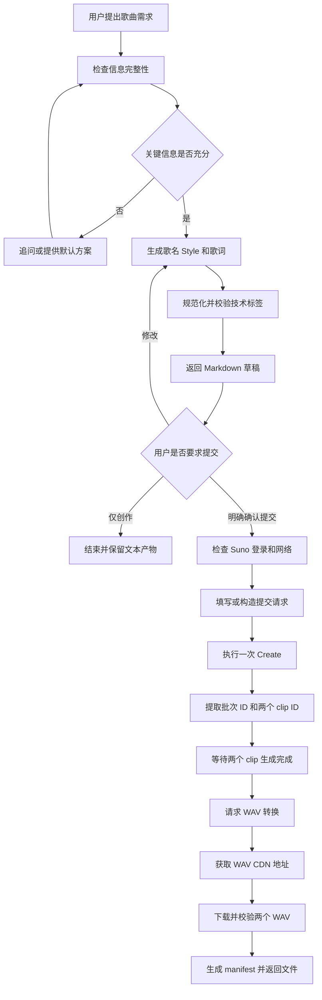
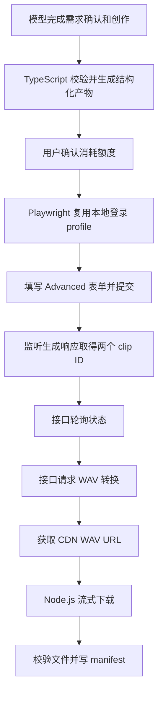

# Suno 歌曲撰写工作流 Skill 需求说明

## 1. 文档信息

- 项目名称：Suno Writer
- Skill 暂定名称：`suno-song-writer`
- 文档状态：需求讨论稿
- 最后更新：2026-08-05
- 当前阶段：需求与技术方案确认，尚未开始 Skill 实现

## 2. 项目目标

创建一个面向 Suno 的歌曲撰写工作流 Skill，完成从需求确认、歌词与曲风创作、规范化输出，到用户授权后提交 Suno、跟踪两首生成结果、下载 WAV 并返回本地文件的完整链路。

该 Skill 应同时满足以下目标：

1. 通过结构化提问明确歌曲主题、内容、语言、曲风和歌词要求。
2. 生成适合 Suno 使用的带英文技术控制标签的歌词。
3. 生成歌名、英文 Style、带技术标签歌词和不含技术词歌词。
4. 对非中文歌词额外提供中文翻译。
5. 经用户明确授权后，将歌词、Style 和歌名提交到 Suno。
6. 跟踪单次提交生成的两首歌曲，等待其完成。
7. 将两首歌曲转换并下载为 WAV，保存到项目目录并返回文件链接。
8. 对消耗 Suno credits 的操作提供确认、幂等和防重复提交保护。
9. 优先利用接口提高稳定性和效率，同时保留浏览器 UI 兜底能力。

## 3. 范围

### 3.1 第一阶段范围

第一阶段实现以下能力：

- 歌曲需求确认。
- 歌词、Style、歌名创作。
- Suno 技术标签规范化。
- 固定 Markdown 输出。
- 不含技术词歌词生成。
- 非中文歌词的中文翻译。
- 字符数和格式校验。
- 用户确认后提交 Suno。
- 获取一个生成批次对应的两个 clip ID。
- 等待两首歌曲完成。
- 请求 WAV 转换并下载两个 WAV 文件。
- 生成本地批次目录和 `manifest.json`。
- 接口不可用时回退到浏览器 UI 操作。

### 3.2 第一阶段不包含

以下能力暂不纳入第一阶段：

- 批量、无人值守连续生成歌曲。
- 自动充值或购买 Suno credits。
- 自动发布、公开或分享歌曲。
- 自动点赞、删除或移动歌曲。
- 自动生成分轨 Stems。
- 自动生成视频。
- 自动绕过验证码、Cloudflare 或其他安全验证。
- 将 Suno Cookie、Bearer Token 或其他凭据持久化到项目中。
- 将 Suno 网页私有接口作为唯一且永久稳定的集成契约。
- 未经用户确认自动重新提交失败或状态不明的生成请求。

## 4. 用户工作流



## 5. 歌曲需求确认

Skill 应确认以下信息。用户已经明确提供的内容不得重复追问。

### 5.1 必要信息

1. 主题：歌曲围绕什么主题展开。
2. 核心内容：人物、事件、情感、意象或需要传达的信息。
3. 歌词语言：中文、英文、日文或其他语言。
4. 曲风：流派、情绪、节奏、年代感、主要乐器等。
5. 歌词要求：结构、篇幅、表达方式、押韵、禁用内容等。

### 5.2 可选信息

- 歌名；未提供时由 Skill 拟定。
- 人声性别。
- 独唱、对唱、和声、合唱或儿童合唱。
- BPM。
- 调性及转调。
- 拍号及拍号变化。
- 目标时长。
- 指定段落结构。
- 配器与演奏法。
- 混音、空间感和动态方向。
- Suno 模型版本及高级参数。
- 需要排除的 Style。

### 5.3 信息不足时的行为

关键信息不足时，Skill 可以：

1. 提出最少量、最关键的澄清问题；或
2. 给出一套明确标注的默认方案供用户确认。

不得在信息明显不足且会显著影响创作方向时假装已经充分理解。

## 6. 创作输出契约

### 6.1 中文歌词

明确要求“撰写歌词”时，至少返回以下四个 Markdown 部分：

```markdown
## 歌词

[Verse 1]

演唱歌词……

## Style

English style prompt

## 歌名

歌曲名称

## 不含技术词的歌词

演唱歌词……
```

默认顺序固定为：

1. `歌词`
2. `Style`
3. `歌名`
4. `不含技术词的歌词`

如后续交互体验表明歌名置顶更便于阅读，可以在实现前再次确认是否调整顺序；提交字段映射不受 Markdown 顺序影响。

### 6.2 非中文歌词

原歌词不是中文时，在上述四个部分之后独立增加：

```markdown
## 中文翻译

中文自然翻译……
```

中文翻译要求：

- 默认翻译不含技术词的演唱歌词。
- 以准确、自然地传达原意为优先。
- 默认不强制保留原文押韵和音节数量。
- 不混入 Suno 技术标签。
- 若用户要求可提供逐段对照翻译。

### 6.3 Suno 字段映射

提交到 Suno 的内容仅包括：

| Markdown 部分 | Suno Advanced 字段 |
|---|---|
| `歌词` | `Lyrics editor` |
| `Style` | `Styles` |
| `歌名` | `Song Title` |

以下内容不得提交到 Suno：

- `不含技术词的歌词`
- `中文翻译`
- 工作流说明或校验报告

## 7. 歌词技术标签规范

### 7.1 基本规则

所有提供给 Suno 的技术控制词应满足：

1. 使用 Suno 可识别或可理解的英文描述。
2. 使用半角中括号 `[]` 包裹。
3. 标签必须独立成行。
4. 标签不得与演唱歌词写在同一行。
5. 演唱歌词保持用户指定的原语种。
6. 不堆叠无意义、冲突或过多的控制标签。
7. 去除控制标签后，剩余文本应能作为纯歌词正常阅读。

### 7.2 常见标签类别

#### 歌曲结构

```text
[Intro]
[Verse 1]
[Verse 2]
[Pre-Chorus]
[Chorus]
[Chorus 2]
[Bridge]
[Final Chorus]
[Outro]
```

#### 人声与角色

```text
[Male Vocal]
[Female Vocal]
[Duet]
[Harmony]
[Choir]
[Child Choir]
[Spoken Word]
[Whispered]
```

#### 器乐段落

```text
[Instrumental Break]
[Piano Interlude]
[Guitar Solo]
[Xiao Solo]
[String Quartet]
```

#### 动态与编排

```text
[Build]
[Breakdown]
[Key Change to C Major]
[Three-Part Harmony]
[Canon]
[Fade Out]
```

标签清单不应作为绝对封闭白名单。模型可根据歌曲需要使用其他英文标签，但必须遵守独立成行和方括号格式。

### 7.3 技术说明规范化

以下写法不符合严格规范：

```text
(string quartet swells, piano arpeggios)
相期邈云汉。(all voices, swell)
```

建议转换为：

```text
[String Quartet Swell]
[Piano Arpeggios]

[All Voices]
[Swell]

相期邈云汉。
```

拼音提示可能被 Suno 当作演唱内容。例如：

```text
相期邈(miǎo)云汉。
```

Skill 应提示用户该风险，并可建议转换为独立控制提示或直接保留汉字：

```text
[Pronounce 邈 as miǎo]

相期邈云汉。
```

### 7.4 用户原稿优先级

用户直接提供歌词时，Skill 应区分三种模式：

1. **严格规范化**：将圆括号技术描述、行内提示等转换为独立中括号标签。
2. **最小修正**：只修正明显可能被唱出的技术文本或格式错误。
3. **原稿提交**：不改写用户内容，仅提示风险。

若用户没有明确选择，提交前应展示规范化结果或说明将按原稿提交。

## 8. Style 规范

Style 默认使用英文，以提升 Suno 对音乐特征的识别和可控性。

建议包含以下维度中的必要项：

- Genre / subgenre
- Mood
- BPM / tempo
- Key / modulation
- Time signature
- Instrumentation
- Vocal arrangement
- Performance style
- Dynamics
- Production / mixing / space

示例：

```text
Chamber Pop, Chill Pop, 68 BPM, A minor modulating to C Major,
xiao bamboo flute with cold breathy tones, grand piano arpeggios,
string quartet, male lead, female harmonies, child choir in final chorus,
solitary, ethereal, intimate, hall reverb, wide stereo
```

不应为了填满字符数而堆叠相互冲突的风格词。

## 9. Suno 页面约束

已通过真实页面确认 Suno `/create` 的 Advanced 模式提供：

| 字段 | 页面限制 |
|---|---:|
| `Lyrics editor` | 5000 字符 |
| `Styles` | 1000 字符 |
| `Song Title` | 可选 |

提交按钮为 `Create song`，默认一次生成两个作品版本。

第一阶段默认使用当前页面选中的模型版本。模型页面显示名称和接口内部名称可能不同，不得根据显示名称硬编码内部模型值。

## 10. 已验证的 Suno 完整链路

以下接口来自 2026-08-05 对 Suno 网页真实操作的观察，属于网页私有接口，不视为 Suno 承诺的官方稳定开发者 API。

### 10.1 歌词草稿项目

页面填写歌词时可能调用：

```http
POST /api/lyrics-projects
POST /api/lyrics-projects/<lyrics-project-id>/flush
```

生成请求可能引用动态 `lyrics_project_id`。

### 10.2 提交生成

```http
POST https://studio-api-prod.suno.com/api/generate/v2-web/
```

核心业务字段示意：

```json
{
  "generation_type": "TEXT",
  "title": "歌曲名称",
  "tags": "English Style",
  "negative_tags": "",
  "mv": "当前模型内部名称",
  "prompt": "带技术标签歌词",
  "make_instrumental": false,
  "metadata": {
    "create_mode": "custom"
  },
  "transaction_uuid": "动态 UUID",
  "lyrics_project_id": "动态歌词项目 ID"
}
```

响应包含：

- 批次 ID。
- 批次状态。
- `batch_size: 2`。
- 两个 clip 对象及其 ID。

生成响应中的两个 clip ID 必须作为本次任务的唯一事实源。不得仅靠歌名、排序位置或提交时间猜测生成结果。

### 10.3 查询生成状态

```http
POST https://studio-api-prod.suno.com/api/feed/v3
Content-Type: application/json
```

请求体示意：

```json
{
  "filters": {
    "ids": {
      "presence": "True",
      "clipIds": ["clip-id-1", "clip-id-2"]
    }
  },
  "limit": 2
}
```

已观察到的生成状态包括：

```text
submitted → streaming → complete / 可下载
```

`streaming` 阶段可能已经返回 `audio_url`、`media_urls` 和时长，但仍不能下载 WAV。完成判据优先使用：

1. clip 状态进入完成态；或
2. `download_song.disabled == false`。

UI 兜底判据：

- 右侧歌曲项的转圈消失。
- 两首均显示完整时长。
- `More options → Download → WAV Audio` 可用。

### 10.4 WAV 转换

生成完成后，对每个 clip 调用：

```http
POST https://studio-api-prod.suno.com/api/gen/<clip-id>/convert_wav/
Content-Type: application/json

{}
```

成功时观察到：

```http
204 No Content
```

随后轮询：

```http
GET https://studio-api-prod.suno.com/api/gen/<clip-id>/wav_file/
```

转换完成时返回：

```json
{
  "wav_file_url": "https://cdn1.suno.ai/<clip-id>.wav"
}
```

最后直接从 `wav_file_url` 下载 WAV 文件。

### 10.5 实测验证结果

测试歌曲：《月下独酌》

一次提交成功生成两首作品，并完成 WAV 下载：

| 版本 | 时长 | 音频格式 |
|---|---:|---|
| 版本 1 | 177.64 秒 | PCM WAV，48kHz，16-bit，Stereo |
| 版本 2 | 177.32 秒 | PCM WAV，48kHz，16-bit，Stereo |

测试文件保存在：

```text
outputs/20260805-035705-yue-xia-du-zhuo/
├── 01-yue-xia-du-zhuo.wav
└── 02-yue-xia-du-zhuo.wav
```

## 11. 鉴权与网络约束

### 11.1 鉴权

实测表明，仅携带浏览器 Cookie 直接请求 Suno 私有接口会返回 `401 Unauthorized`。

网页请求还依赖动态认证信息，例如：

- `Authorization: Bearer <dynamic-token>`
- `browser-token`
- `device-id`
- 动态 session token
- 动态 transaction UUID

安全要求：

1. 不在 Skill、源码、配置、日志或 `manifest.json` 中保存认证令牌。
2. 不在最终回复中展示完整令牌、Cookie、邮箱、手机号或其他个人信息。
3. 认证信息仅存在于当前已登录浏览器会话和单次操作内存中。
4. 令牌失效时重新通过正常浏览器登录流程获取，不尝试绕过认证。
5. 不硬编码用户 ID、套餐 ID、设备 ID或模型内部名称。

### 11.2 代理和网络

当前环境访问 Suno 需要开启代理，代理可能显著降低 WAV 下载速度。

Skill 应区分两类网络阶段：

1. **必须访问 Suno 的阶段**：登录、填写、提交、状态查询、触发 WAV 转换。
2. **CDN 下载阶段**：取得 `wav_file_url` 后下载大文件。

实现时应：

- 在提交前检查 Suno 页面可访问性。
- 网络不可用时明确失败，不自动重复提交。
- 对状态查询设置合理轮询间隔与总超时。
- 对 WAV CDN 下载支持超时和有限次数重试。
- 已有完整目标文件时不得无条件重复下载。
- 下载中断时应删除或隔离不完整临时文件。

## 12. 技术选型

### 12.1 总体架构

采用“模型编排 + Node.js/TypeScript 确定性工具 + Browser MCP/Playwright + HTTP CDN 下载”的混合方案。

推荐基础技术栈：

| 类别 | 选型 |
|---|---|
| 运行时 | Node.js 22 LTS |
| 开发语言 | TypeScript |
| 包管理器 | pnpm |
| 浏览器自动化 | Playwright（`launchPersistentContext` 复用本地登录 profile） |
| 开发联调取证 | Browser MCP 会话快照，见 `.playwright-mcp/`（只读，不入库） |
| HTTP 客户端 | Node.js 原生 `fetch`、Web Streams 和 `AbortSignal` |
| 数据及契约校验 | Zod |
| 测试 | Vitest |
| 文件与哈希 | Node.js 原生 `node:fs`、`node:path`、`node:crypto` |
| 状态持久化 | `manifest.json`，第一阶段不引入数据库 |
| 登录态 | 本地浏览器 profile 目录，运行时不得提取、保存或输出凭据 |



### 12.2 模型职责

模型负责需要语义理解、创造性和权衡的部分：

- 需求完整性判断。
- 澄清问题设计。
- 歌词创作和修改。
- 曲式结构设计。
- 技术标签选择。
- Style 创作。
- 歌名创作。
- 中文翻译。
- 对歌词质量、情绪和音乐方向进行解释。

### 12.3 Node.js 与 TypeScript 职责

Node.js 工具负责确定性、可测试和涉及文件安全的操作：

- 使用 TypeScript 定义歌曲输入、批次状态、clip 状态和 manifest 类型。
- 使用 Zod 校验 CLI 输入、脚本输出及外部接口响应的必要字段。
- 校验 Markdown 输出结构。
- 校验标签是否使用英文方括号并独立成行。
- 识别圆括号技术提示和行内技术词，输出可操作的 warnings。
- 提取不含技术词的歌词。
- 校验歌词和 Style 字符数。
- 规范化输出目录及文件名。
- 使用原生 `fetch` 和 Web Streams 流式下载 WAV。
- 先下载到 `.part` 临时文件，校验成功后原子重命名。
- 检查 RIFF/WAVE 文件头和基本 PCM 参数。
- 使用 `node:crypto` 计算 SHA-256。
- 生成和原子更新 `manifest.json`。
- 通过统一 JSON 信封输出成功、错误码、错误信息和 warnings。
- 使用 `AbortSignal`、有限重试和退避控制查询与下载超时。

依赖原则：

1. 优先使用 Node.js 原生能力。
2. 第一阶段业务依赖只需 Zod；Playwright 用于独立浏览器自动化。
3. 使用 Vitest 覆盖歌词解析、状态机、幂等保护、WAV 校验和 manifest 更新。
4. 只有确实需要解析更多音频元数据时，才评估 `music-metadata`。
5. 暂不引入 Express、NestJS、数据库、Redis、队列系统、Axios 或重型工作流框架。
6. 歌词创作和语义判断不得硬编码到 TypeScript 中，仍由模型负责。

### 12.4 脚本正交性与单一职责

所有脚本和模块必须保持功能正交、职责单一，禁止实现将多数流程集中在一个文件或命令中的 “anyscript”。

强制约束：

1. 一个模块只对应一个清晰的变化原因，例如歌词校验、纯歌词提取、状态查询、WAV 转换、文件下载或 manifest 写入。
2. 浏览器交互、接口调用、认证上下文、状态轮询、文件下载、音频校验和状态持久化必须分离。
3. CLI 仅负责解析参数、调用用例和输出结果，不包含业务规则、Playwright 定位器或 Suno 接口细节。
4. 工作流编排层只组合能力，不直接实现歌词解析、HTTP、浏览器定位、文件流或 WAV 二进制解析。
5. Suno 接口适配器不得操作本地输出目录；输出模块不得知道 Suno 的 URL、认证头或页面结构。
6. 纯函数模块不得读取环境变量、访问网络、启动浏览器或写文件。
7. 每个写操作必须有明确输入和返回值，不通过隐式全局状态传递业务数据。
8. 动态认证上下文是独立能力，只提供最小读取接口，不负责发请求、轮询或持久化。
9. 重试和超时是通用策略模块，由调用方显式组合，不得在每个适配器中复制一套实现。
10. 不为减少文件数量而合并职责；也不为形式上的“微模块”拆出没有独立语义的单行包装。

脚本与模块之间统一采用结构化契约。可执行入口成功和失败均返回稳定 JSON 信封：

```json
{
  "ok": true,
  "data": {},
  "warnings": []
}
```

```json
{
  "ok": false,
  "error": {
    "code": "STABLE_ERROR_CODE",
    "message": "Human-readable message"
  },
  "warnings": []
}
```

模块依赖方向必须保持单向：

```text
domain / lyrics / ports
          ↑
application use cases
          ↑
adapters: playwright / suno-http / filesystem
          ↑
CLI composition root
```

其中 `domain`、`lyrics` 和端口定义不得反向依赖 Playwright、Suno 私有接口或文件系统实现。

### 12.5 Playwright 职责

项目内 Playwright 适配器负责所有浏览器交互，是第一阶段提交 Suno 的主路径：

- 通过 `launchPersistentContext` 复用本地 profile，由用户正常完成登录；不处理凭据本身。
- 打开 `https://suno.com/create`。
- 切换 Advanced 模式。
- 填写 `Lyrics editor`、`Styles` 和 `Song Title`。
- 点击消耗 credits 的 `Create song`。
- 通过 `page.waitForResponse` 监听 `generate/v2-web` 响应，提取批次和两个 clip ID。
- 从请求事件捕获动态认证头，移交 `transient-auth` 内存组件。
- 私有接口失效时通过 UI 观察生成状态。
- 接口下载失败时通过 `More options → Download → WAV Audio → Download File` 兜底。
- 为联调输出 sanitized trace（trace / screenshot / console），写操作步骤的截图留档。

页面定位优先使用可访问性名称和角色，不依赖易变的 CSS class。监听到的认证头仅可保存在进程内存中，不得序列化、写入日志或 manifest。

### 12.6 Browser MCP 与 `.playwright-mcp/` 证据目录

Browser MCP（Zed 内置）仅用于开发与联调阶段的探索和取证，不作为 Skill 运行时的执行引擎。

Browser MCP 每次会话会在项目根目录生成 `.playwright-mcp/` 目录，包含：

- `page-*.yml`：每次操作后的可访问性快照，用于还原页面结构、确认控件 role 与名称。
- `console-*.log`：浏览器 console 输出，用于排查页面侧错误。
- 下载事件的默认保存文件，例如本次的 `月下独酌.wav`。

使用约束：

1. 该目录是**只读证据来源**，禁止作为运行时依赖或状态存储。
2. 开发 Playwright 选择器时，以其中最近一次快照为参考核对控件命名变化。
3. 该目录可能包含敏感信息（用户 profile、作品标题、文件名），必须加入 `.gitignore`，不得提交。
4. Skill 正式运行产出的日志由 Playwright 适配器自己生成（sanitized trace / screenshot / console），存放于批次目录，与 `.playwright-mcp/` 相互独立。

### 12.7 接口访问策略

采用接口增强模式，而不是纯私有 API 模式：

1. 创建默认仍由 Suno 页面触发，降低构造动态请求参数和重复扣费风险。
2. 监听生成响应，直接提取批次及两个 clip ID。
3. 状态查询优先走 `feed/v3`。
4. WAV 转换优先走 `convert_wav` 和 `wav_file`。
5. WAV 文件直接从返回的 CDN 地址下载。
6. 任一私有接口变化时回退 UI，不应让整体工作流完全失效。

未来若 Suno 提供稳定官方 API，应增加官方 API 适配器，并优先于网页私有接口。

## 13. 提交授权与额度保护

点击 `Create song` 会消耗 Suno credits，属于有成本的写操作。

必须遵守：

1. 默认先生成和展示 Markdown 草稿。
2. 用户明确说“提交”“生成歌曲”“确认生成”等之后才可点击 `Create`。
3. 一次确认只允许提交一个批次。
4. 提交前记录本地任务 ID、歌名和输入内容哈希。
5. 点击提交后立即进入“状态不明但禁止重试”状态，直到确认请求成功或明确失败。
6. 网络超时不能直接再次点击 `Create`。
7. 如果响应已经返回批次或 clip ID，后续必须复用这些 ID。
8. 若无法判断是否已经扣费或提交成功，应先检查页面新增作品和生成记录，再让用户决定是否重试。
9. 自动重试只允许用于无副作用的状态查询和文件下载，不允许用于生成提交。

建议任务状态：

```text
draft
awaiting_confirmation
submitting
submitted
generating
converting_wav
downloading
completed
partial_failure
failed
unknown_submission_state
```

## 14. 状态轮询与超时

建议策略：

- 初始轮询间隔：5 秒。
- 生成中轮询间隔：5 至 10 秒，可逐步退避。
- 单次歌曲生成总超时：建议 15 分钟，可配置。
- WAV 转换轮询间隔：3 至 5 秒。
- 单首 WAV 转换总超时：建议 10 分钟，可配置。
- CDN 下载超时：根据文件大小和代理速度配置，建议不少于 5 分钟。

超时后：

- 保留批次 ID 和 clip ID。
- 不重新提交生成。
- 将任务标记为可恢复状态。
- 后续可基于原 clip ID 继续查询或下载。

## 15. 输出目录与文件

建议每个生成批次使用独立目录：

```text
outputs/<timestamp>-<slug>/
├── song.md
├── manifest.json
├── 01-<slug>.wav
└── 02-<slug>.wav
```

示例：

```text
outputs/20260805-035705-yue-xia-du-zhuo/
├── song.md
├── manifest.json
├── 01-yue-xia-du-zhuo.wav
└── 02-yue-xia-du-zhuo.wav
```

默认不将生成的 WAV 文件提交到 Git。

### 15.1 `song.md`

保存最终确认的：

- 歌词
- Style
- 歌名
- 不含技术词的歌词
- 非中文歌词的中文翻译（如适用）

### 15.2 `manifest.json`

建议结构：

```json
{
  "schema_version": 1,
  "task_id": "local-task-uuid",
  "title": "歌曲名称",
  "slug": "song-slug",
  "status": "completed",
  "submitted_at": "ISO-8601 timestamp",
  "completed_at": "ISO-8601 timestamp",
  "suno": {
    "batch_id": "batch-id",
    "model_display_name": "v5.5",
    "clip_ids": ["clip-id-1", "clip-id-2"]
  },
  "inputs": {
    "lyrics_sha256": "sha256",
    "style_sha256": "sha256"
  },
  "tracks": [
    {
      "index": 1,
      "clip_id": "clip-id-1",
      "status": "downloaded",
      "file": "01-song-slug.wav",
      "duration_seconds": 177.64,
      "sample_rate_hz": 48000,
      "channels": 2,
      "bit_depth": 16,
      "sha256": "sha256"
    },
    {
      "index": 2,
      "clip_id": "clip-id-2",
      "status": "downloaded",
      "file": "02-song-slug.wav",
      "duration_seconds": 177.32,
      "sample_rate_hz": 48000,
      "channels": 2,
      "bit_depth": 16,
      "sha256": "sha256"
    }
  ],
  "warnings": []
}
```

禁止写入 manifest：

- Cookie
- Bearer Token
- browser-token
- device-id
- 邮箱或手机号
- 其他可用于登录或识别个人身份的敏感信息

## 16. 异常处理

### 16.1 登录失效

- 检测到登录页面或接口 `401` 时停止。
- 提示用户正常登录。
- 不尝试保存、刷新或伪造认证令牌。

### 16.2 代理关闭或 Suno 不可达

- 在提交前发现不可达：不提交，返回明确错误。
- 提交后网络中断：进入 `unknown_submission_state`，不得重复提交。
- 保存已有批次和 clip ID，以便网络恢复后继续。

### 16.3 一首成功、一首失败

- 将任务标记为 `partial_failure`。
- 下载成功的版本。
- 明确报告另一个 clip 的失败状态和错误信息。
- 不自动重新生成整个批次。

### 16.4 WAV 转换失败

- 保留完成的 clip ID。
- 对无副作用的 `wav_file` 查询允许有限重试。
- `convert_wav` 是否可安全重试需根据响应和幂等性证据判断。
- 可通过 UI 下载菜单兜底。

### 16.5 CDN 下载失败

- 使用临时文件名下载，例如 `.part`。
- 完成后再原子重命名为 `.wav`。
- 下载失败时不保留伪完整文件。
- 支持有限次数重试。
- 最终校验 RIFF/WAVE 文件头和非零音频数据。

### 16.6 页面结构变化

- 优先使用 role、label 和可访问性名称定位。
- 接口失败时转 UI。
- UI 也无法识别时停止并提供页面状态证据，不盲目点击。

## 17. 安全和合规要求

- 不绕过 Suno 登录、验证码、Cloudflare 或账号限制；Playwright 使用本地 profile 复用用户正常登录态，不处理凭据本身。
- 不硬编码或提交任何密钥、Cookie、Token。
- 不在日志中打印完整认证请求头。
- 不未经授权消耗 credits。
- 不未经授权发布或公开歌曲。
- 不自动模仿或声称复刻特定在世艺术家的独特风格；可改写为抽象音乐特征。
- 用户提供现有歌词或诗歌时，应提醒其确认拥有相应使用权，或确认内容处于公有领域。
- Suno 私有接口可能受服务条款约束，正式长期使用前应核对 Suno 当前条款和官方 API 政策。

## 18. 建议的项目结构

```text
suno-writer/
├── .agents/
│   └── skills/
│       └── suno-song-writer/
│           ├── SKILL.md
│           └── references/
│               ├── suno-tags.md
│               ├── output-contract.md
│               └── suno-integration.md
├── src/
│   ├── cli/
│   │   ├── index.ts
│   │   ├── validate-command.ts
│   │   ├── submit-command.ts
│   │   └── resume-command.ts
│   ├── domain/
│   │   ├── song.ts
│   │   ├── generation.ts
│   │   ├── manifest.ts
│   │   └── errors.ts
│   ├── ports/
│   │   ├── song-submitter.ts
│   │   ├── generation-reader.ts
│   │   ├── wav-converter.ts
│   │   ├── file-downloader.ts
│   │   └── manifest-store.ts
│   ├── application/
│   │   ├── validate-song.ts
│   │   ├── submit-song.ts
│   │   ├── await-generation.ts
│   │   ├── acquire-wav.ts
│   │   └── resume-batch.ts
│   ├── lyrics/
│   │   ├── validate-markdown.ts
│   │   ├── validate-tags.ts
│   │   ├── normalize-tags.ts
│   │   └── strip-technical-lines.ts
│   ├── adapters/
│   │   ├── playwright/
│   │   │   ├── create-form.ts
│   │   │   ├── generation-response-listener.ts
│   │   │   └── wav-download-fallback.ts
│   │   ├── suno-http/
│   │   │   ├── transient-auth.ts
│   │   │   ├── generation-status-client.ts
│   │   │   └── wav-conversion-client.ts
│   │   └── filesystem/
│   │       ├── batch-directory.ts
│   │       ├── stream-downloader.ts
│   │       ├── wav-validator.ts
│   │       └── json-manifest-store.ts
│   └── shared/
│       ├── retry.ts
│       ├── timeout.ts
│       └── slug.ts
├── tests/
├── outputs/
├── package.json
├── pnpm-lock.yaml
├── tsconfig.json
├── vitest.config.ts
├── req.md
└── README.md
```

`.playwright-mcp/` 为开发联调阶段的只读证据目录，不入库、不参与上述结构。

目录按端口与适配器拆分，避免通用 `private-api-client.ts`、`browser-client.ts` 或 `utils.ts` 逐步吸收无关职责：

- `create-form.ts` 只负责 Advanced 表单和一次性提交。
- `generation-response-listener.ts` 只负责从生成响应提取批次和 clip ID。
- `generation-status-client.ts` 只负责查询 clip 状态。
- `wav-conversion-client.ts` 只负责触发转换和取得 `wav_file_url`。
- `transient-auth.ts` 只维护进程内认证上下文，禁止持久化。
- `stream-downloader.ts` 只负责 URL 到临时文件的流式下载和原子落盘。
- `wav-validator.ts` 只负责 WAV 格式与元数据校验。
- `json-manifest-store.ts` 只负责 manifest 的读取、校验和原子写入。
- `application/` 中的用例负责组合端口，不包含适配器实现细节。

第一阶段不通过私有接口绕过页面直接构造生成请求。接口变化时由用例选择 Playwright UI fallback，而不是让 HTTP 适配器直接调用浏览器适配器。

## 19. 验收标准

### 19.1 创作验收

- 能根据用户输入确认主题、内容、曲风和歌词要求。
- 明确要求写歌词时输出固定四个 Markdown 部分。
- 非中文歌词额外输出独立中文翻译。
- 技术标签使用英文中括号并独立成行。
- 演唱歌词保持原语种。
- 能生成不含技术词的纯歌词。
- 歌词不超过 Suno 页面限制。
- Style 不超过 Suno 页面限制。

### 19.2 提交验收

- 未经确认不会点击 `Create`。
- 一次授权仅提交一次。
- 能取得响应中的两个 clip ID。
- 不依赖同名歌曲或列表顺序识别结果。
- 状态不明时不会自动重新提交。

### 19.3 下载验收

- 能等待两首歌曲进入可下载状态。
- 能对两个 clip 请求 WAV 转换。
- 能取得两个 `wav_file_url`。
- 能将两个 WAV 保存到同一批次目录。
- 文件通过 RIFF/WAVE 和基本音频参数校验。
- 返回项目相对路径供用户点击。
- 部分失败时如实报告，不伪造完整成功。

### 19.4 安全验收

- 项目文件和日志中不存在认证令牌或 Cookie；`.playwright-mcp/` 已加入 `.gitignore`。
- `manifest.json` 不含个人敏感信息。
- 网络和接口错误不会导致重复扣费。
- 私有接口失效时有浏览器 UI 兜底或明确失败路径。

### 19.5 工程边界验收

- 不存在同时负责浏览器操作、Suno HTTP、状态轮询、文件下载和 manifest 写入的 anyscript。
- 每个模块可以用一句话说明唯一职责和唯一主要变化原因。
- CLI 和 application 用例不包含 Playwright 选择器、Suno URL 或 WAV 二进制解析。
- Suno 适配器不写本地业务文件，文件系统适配器不知道 Suno 认证与接口结构。
- 纯歌词模块可在无网络、无浏览器、无文件系统的测试环境中运行。
- 动态认证信息仅存在于独立内存组件中，并且不会被结构化日志序列化。
- 重试、超时、下载和状态轮询均可分别单元测试。
- 所有可执行入口使用稳定 JSON 信封、错误码和退出码。
- 每个适配器至少有独立契约测试；工作流测试通过端口 mock 组合，不依赖真实 Suno。
- 新功能若无法自然归入现有单一职责模块，应新增端口、用例或适配器，不得继续扩张无关模块。

## 20. 待确认事项

动工前仍需最终确认：

1. Skill 名称是否确定为 `suno-song-writer`。
2. Markdown 四部分顺序是否保持“歌词、Style、歌名、不含技术词的歌词”。
3. 用户未指定规范化模式时，默认采用“严格规范化”还是“最小修正”。
4. 非中文歌词的中文翻译是否默认自然意译、不保留押韵。
5. 是否默认启用“草稿展示 → 用户确认 → 提交”的额度保护流程。
6. 生成结果是否统一保存到 `outputs/<timestamp>-<slug>/`。
7. 是否需要第一阶段就实现可恢复任务，即代理恢复后基于已有 clip ID 继续下载。
8. 私有 API 适配是否只在当前浏览器会话中启用，并始终保留 UI fallback。

## 21. 实施建议

建议按以下顺序实施：

1. 初始化 Node.js 22、TypeScript、pnpm、Zod、Playwright 和 Vitest 工程。
2. 创建项目级 Skill 目录和 `SKILL.md`。
3. 编写输出契约及技术标签参考文档。
4. 定义 domain 类型、端口接口、结构化 IO 信封和稳定错误码。
5. 分别实现歌词结构、长度、标签校验、标签规范化和纯歌词提取模块。
6. 分别实现批次目录、流式下载、WAV 校验和 manifest store 适配器。
7. 分别实现 Playwright 表单提交、生成响应监听和 UI 下载 fallback 适配器。
8. 分别实现生成状态查询与 WAV 转换 HTTP 适配器。
9. 在 application 层组合提交、等待、获取 WAV 和恢复用例，保持适配器互不调用。
10. 增加超时、幂等保护和可恢复机制。
11. 使用 Vitest 分模块完成不消耗额度的单元测试和接口契约测试。
12. 增加架构边界测试或 lint 规则，防止 domain/ports 反向依赖 adapters。
13. 最后再使用一个真实生成批次进行端到端回归验证。

## 22. 新会话交接说明

本文档已包含接手本项目的全部必要信息，任何模型（包括纯文本模型）都可在不含图片历史的新会话中直接接手：历史会话中的截图等多模态内容已全部转化为本文档的文字描述与接口契约（§10），页面控件结构可参考 `.playwright-mcp/page-*.yml` 文本快照，无需也无法依赖原会话中的图片。

交接步骤：

1. 在 Zed 中开启新线程，不要沿用含多模态消息的旧会话。
2. 用 @ 引用本文档（`req.md`）作为上下文；如需核对页面控件命名，再引用 `.playwright-mcp/` 中最近一次快照。
3. 首条消息可直接使用：

```text
阅读 req.md，这是 Suno 歌曲撰写 Skill 的完整需求与技术方案，也是唯一事实源。
请按 §21 的顺序实施，遵守 §12.4 的正交性与单一职责约束（禁止 anyscript），
技术栈为 Node.js 22 + TypeScript + pnpm + Playwright + Zod + Vitest。
未经我明确确认，不得执行任何会消耗 Suno credits 的真实提交。
```

4. 后续联调若需要页面视觉信息，将截图内容转述为文字，或让模型读取 Playwright 生成的 snapshot/trace 文本，不要向纯文本模型粘贴图片。
